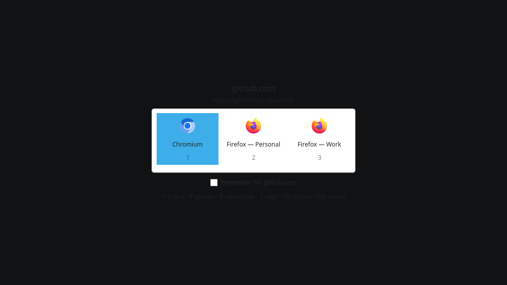
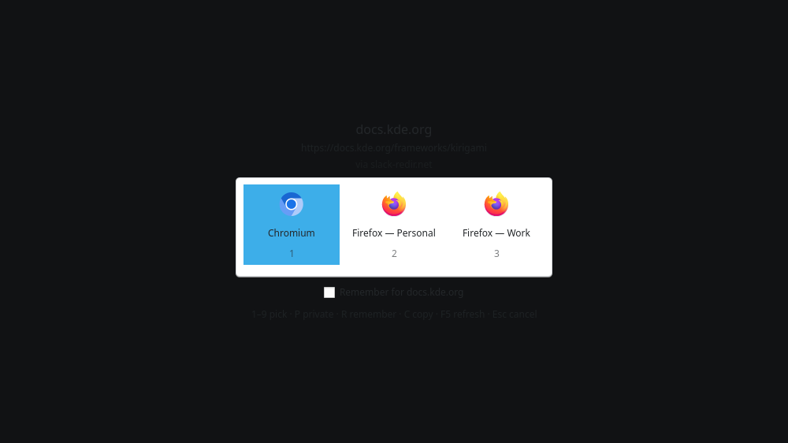
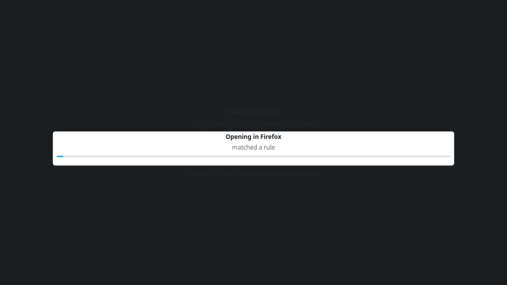

# Lob

A link router for KDE Plasma. Lob registers as the system handler for `http`
and `https` and decides where each link should go, instead of sending
everything to one default browser.

- Links matching a rule open immediately, after a short bar you can interrupt.
- Anything else shows a keyboard-driven picker of installed browsers and their
  profiles, with an option to remember the choice for that host.
- `http` and `https` only. Not mail links, not local files, not PDFs. URLs
  carrying credentials (`https://user:pw@host/`) are refused outright.



A link clicked in Slack arrives wrapped in a redirector. Lob reads through it
first, so the picker asks about the page rather than about `slack.com` -- and
"remember for this host" records the destination:



When a rule already knows the answer, it says so and gets on with it. Any key
catches the decision before it goes:



## Install

### Arch

The release ships a ready-to-build package, so no AUR account is involved:

```bash
curl -LO https://github.com/puco/lob/releases/latest/download/aur-lob.tar.gz
tar xzf aur-lob.tar.gz
makepkg -si
```

That PKGBUILD carries the release tarball's real checksum, so the download is
verified before anything is built.

> **Not on the AUR yet.** `lob` and `lob-git` are prepared and both build
> cleanly, but AUR account registration is closed at the time of writing. Once
> it reopens they will be submitted under those names and this becomes
> `paru -S lob`.

### Fedora

```bash
sudo dnf copr enable puco/lob
sudo dnf install lob
```

Fedora 43 and later; earlier releases do not carry KDE Frameworks 6.19. The
spec lives in [packaging/fedora](packaging/fedora) and CI builds it on every
change, so building it yourself with `rpmbuild` works too.

> **Not on COPR yet.** The spec builds and installs cleanly; publishing it
> needs a Fedora account, which is tracked in
> [issue #8](https://github.com/puco/lob/issues/8).

### Other distributions

Build from source. Lob needs KDE Frameworks 6.19+ and layer-shell-qt 6.6+,
which most stable releases are still behind. There is no Flatpak and probably
will not be: a sandboxed Lob cannot launch a host browser with the modified
command line that per-profile routing depends on, so it would quietly lose the
main reason to use it.

Then start the daemon and claim the link handler:

```bash
systemctl --user enable --now lob.service
lob --set-default
```

`lob --restore-default` puts your previous browser back at any time.

## Build from source

Needs Qt 6.6+, KDE Frameworks 6.19+, layer-shell-qt 6.6+ and
`extra-cmake-modules`. Dependencies may themselves require a newer Qt. On Arch:

```bash
sudo pacman -S --needed extra-cmake-modules cmake ninja qt6-base qt6-declarative qt6-svg \
    kirigami kirigami-addons ki18n kcoreaddons kconfig kdbusaddons knotifications \
    kwindowsystem kiconthemes kcolorscheme kcrash kstatusnotifieritem kservice kio \
    layer-shell-qt qqc2-desktop-style
```

```bash
cmake -B build -G Ninja -DCMAKE_BUILD_TYPE=Release -DCMAKE_INSTALL_PREFIX="$HOME/.local"
cmake --build build
cmake --install build
ctest --test-dir build
```

`ctest` runs everything that works without a display. The picker's own path --
a layer-shell overlay holding an exclusive keyboard grab -- needs a compositor,
and taking one over is not something a test run should do to the desktop you
are sitting at, so those tests skip unless you ask for them:

```bash
tests/run-under-compositor.sh --test-dir build --output-on-failure
```

That starts a throwaway headless sway with two outputs, runs the tests inside
it, and takes it down again. It needs `sway` installed, and skips cleanly if it
is not.

## Use

```bash
lob --list                 # discovered browsers, profiles and launch commands
lob --explain <url>        # which rule decides this URL, and which ones lost
lob --forget <host>        # drop the choice remembered for a host, so it asks again
lob --settings             # open the settings window
lob --status               # who currently handles http/https
lob --set-default          # claim the handler (records what was there first)
lob --restore-default      # put the previous browser back
lob <url>                  # route one URL
lob --pick <url>           # route one URL, ignoring rules
lob --help                 # the same list, from the program itself
```

Start the daemon at login so the picker is instant rather than paying a QML
startup on the first click:

```bash
systemctl --user enable --now lob.service
```

After upgrading, restart it:

```bash
systemctl --user restart lob.service
```

Every `lob` command reaches the daemon that is already running, so until it is
restarted the old one answers -- and an older Lob that does not know a new
option simply does nothing with it.

### In the picker

`1`–`9` pick · `/` filter · `P` private window · `R` remember (press again for
a wider scope) · `C` copy instead of opening · `F5` (or `Ctrl+R`) rescan
browsers · `Esc` cancel · arrows and `Enter` also work.

`/` or `Ctrl+F` starts filtering, which is what the list needs once a machine
has more browsers and profiles than there are digits. Every whitespace-separated
term has to appear somewhere -- the label, the profile name or the desktop id --
so `fire work` finds Firefox's work profile without knowing which field holds
which word, and `chromium.desktop` finds it by the id `lob --list` prints.

The digits keep working while filtering and number the cells left on screen, so
narrowing the list and pressing `1` is the fast path. `P`, `R` and `C` are
letters, so while filtering they move to `Alt+P`, `Alt+R` and `Alt+C`. `Esc`
clears the filter first and cancels the picker second, and `Backspace` past the
start of the filter leaves filtering as well.

Holding **Shift** while clicking a link forces the picker even when a rule
would have matched. During the hold bar, any key or click does the same.
This gesture requires a nonzero hold duration; `--pick` also works with a zero hold.

Private mode never silently falls back to a normal window. Unsupported targets
are disabled, and a launch failure leaves the link in the picker for retry.
Escape can cancel while an activation token is pending; once the launch has
been dispatched, Lob waits for its result.
After copying, a one-shot process stays alive while it owns the clipboard so
the selection remains available. On Wayland, even a zero-hold copy briefly
presents a surface to obtain the focus required to own the selection.

Browser/profile changes are discovered automatically. `F5` in the picker
rescans immediately. Explicit profile IDs remain stable when other profiles are
added or removed; a plain desktop ID selects the browser's own default. Old
remembered desktop IDs are upgraded only when a single profile makes the
intended choice unambiguous; otherwise Lob asks again.

The picker never lists a browser and a profile that would do the same thing.
One profile shows as the browser ("Firefox"); several show as the profiles
themselves, since the browser's own entry opens whichever is default anyway.
Both IDs stay usable in rules either way, and `lob --list` shows every one of
them, marking those the picker leaves out.

**Pause Routing** uses the configured browser fallback, then the previous
browser for the URL's scheme. If neither is available, it shows the picker.

This works because a Wayland client can see which keys were already held when
it takes keyboard focus, which is the only moment the gesture is observable --
the modifier is held in the application that opened the link, not in Lob.

### Redirects

A link clicked in Slack, a search result or a mail client usually arrives as a
redirector's URL rather than the page it points at. Lob reads the destination
out of it before deciding anything, so the picker asks about the page, a rule
matches on it, and **remember for this host** records it — rather than recording
`slack.com`, which every link from Slack would then match.

Only redirectors that carry their destination in the URL are read, and reading
them costs nothing: no request is made, so the tracker never hears from Lob.
Known ones include Slack, Google and DuckDuckGo result links, Reddit, Facebook,
Instagram, YouTube, LinkedIn, Steam, VK, Tumblr and Outlook SafeLinks. The
picker shows the destination with a `via <host>` line, so a URL that is not the
one you clicked is never a surprise.

A workspace with single sign-on is the other shape this takes: Slack sends the
link through itself as the identity provider, with the destination inside a
signed login hint rather than in a plain parameter. Lob reads the claim to route
the link and opens the original, because that URL is what signs you in before
you land on the page. The hint is short-lived and carries your identity, which
is one more reason Lob never writes URLs to the log.

Link scanners are the exception to opening what was read. A SafeLinks URL exists
to be visited — that is where the scan happens — so Lob routes by the
destination but still hands the browser the scanner's URL. Everything else opens
as the destination, which leaves the click-tracker out of it entirely.

Shorteners (`t.co`, `bit.ly`, `lnkd.in`) keep their destination on their own
server, so there is nothing to read without asking them. By default those links
are routed as-is and the browser follows the redirect as before. Turning on

```json
"resolveShorteners": true
```

makes Lob ask instead: a cookieless `HEAD` request, at most 1.5s, before the
link is routed. The trade is real — the link waits for it, the shortener sees a
request from this machine before the browser makes one, and an unreachable or
slow shortener simply routes as it arrived. Off unless you want that.

Add a redirector Lob does not know with `redirectWrappers`, mapping
`host` or `host/path` to the query parameter holding the destination:

```json
"redirectWrappers": { "go.corp.example/out": "to" }
```

Set `"unwrapRedirects": false` to switch all of this off.

## Configuration

**Configure Lob…** in the tray menu, or `lob --settings`, opens a window over
the rules, the remembered choices, the applications that are hidden until
enabled, and the hold duration. It edits the same `rules.json` described below
and is not a replacement for it: the file stays hand-editable, and the window
says where it is.

The window is a second view onto the running daemon's configuration rather than
a copy of it. A file edited in `$EDITOR` while the window is open, a choice
remembered by a picker, and `lob --forget` all arrive the same way -- the
configuration changed, and the window follows. A genuinely concurrent write is
refused rather than silently winning, as it is everywhere else.

Rules are shown in the order they are matched, because that order decides which
one wins, and can be reordered there. Remembered choices are a separate section:
they are kept narrowest-first by whatever wrote them, so they are listed and
deleted rather than sorted. A rule that cannot work -- a `pathPrefix` with no
path, an `open` with no target -- is refused when it is added, with the reason,
rather than being saved into a file that then fails to load.

`~/.config/lob/rules.json`, watched, so edits apply without a restart. A
malformed or unreadable file leaves the last valid configuration active and
blocks saves until it is repaired, so a half-finished edit never costs you the
rules you already had. Deleting the file resets Lob to its defaults, which is
what deleting it is for. Save conflicts and write failures are reported rather
than overwriting an edit made elsewhere.

```json
{
  "version": 1,
  "holdMs": 600,
  "stripTracking": true,
  "fallbackTarget": "",
  "enabledOtherHandlers": ["chatgpt.desktop"],
  "rules": [
    { "match": "hostSuffix", "pattern": "corp.example",
      "action": "open", "target": "microsoft-edge.desktop" },

    { "match": "pathPrefix", "pattern": "github.com/anthropics",
      "action": "open", "target": "firefox.desktop#/home/you/.config/mozilla/firefox/xyz.work" },

    { "match": "host", "pattern": "bank.example", "action": "ask" },

    { "match": "regex", "pattern": "^https://.*\\.pdf$", "action": "copy" }
  ]
}
```

`match` is `host`, `hostSuffix`, `pathPrefix` or `regex`. `hostSuffix` covers
the bare domain as well as subdomains. `pathPrefix` carries host and path in
one pattern and needs both, so `github.com` is refused rather than accepted as
a rule that could never match -- write it as a `host` rule instead. `action` is
`open`, `ask` or `copy`. Target ids come from `lob --list`.

The file is strict JSON (no comments). `holdMs` is an integer from 0 to 60000;
zero skips the hold bar. An empty `fallbackTarget` means ask. An omitted
`trackingParameters` uses the built-in list, while `[]` disables all stripping.
Path-prefix and regex rules support `"caseSensitive": true`. Omission keeps
version 1's case-insensitive behavior; host comparisons are always insensitive.

Explicit rules always win over remembered ones, wherever they sit in the file,
so a choice made in passing can never shadow one you wrote deliberately.

### What "remember" covers

`R` in the picker remembers the host. Pressing it again widens the scope, and
the label always names the pattern about to be written rather than describing
it:

| Scope | Written as | Covers |
| --- | --- | --- |
| Host | `docs.kde.org` | that host only |
| Domain | `kde.org` | the domain and every subdomain |
| Path | `docs.kde.org/plasma` | that host under that first path segment |

A scope that has nothing to say about the link is not offered: no path scope
for a URL with no path, no domain scope for an IP address or for a host that is
already its own domain. A registry suffix is never offered as a domain, so
`bbc.co.uk` widens to `bbc.co.uk` and never to `co.uk`.

Narrower memories are written ahead of broader ones, so remembering a whole
domain later never overrides the answer already given for one host inside it.

`lob --forget <host|url>` drops the memory that actually decides that link,
which is not always the one named after the host — a path memory is what
answers a link it covers, so that is what goes. When a link is covered by more
than one, the command says what is still remembered. `lob --explain` names the
undo command for whichever memory it reports.

### Other handlers

Applications that register for `https` without being browsers — a chat app
catching OAuth callbacks, say — are discovered but hidden until listed in
`enabledOtherHandlers`. They are never filtered out of discovery: whether
routing a link to one is useful is your call.

## Notes

- Qt on Arch logs to the journal, so use `journalctl --user -f` rather than
  stderr. `QT_LOGGING_RULES="lob.*=true"` turns on the detail.
- `LOB_NO_LAYERSHELL=1` runs the picker as an ordinary window instead of a
  layer-shell overlay with an exclusive keyboard grab. Useful when iterating
  on the UI.
- **Wayland is what Lob is built for and tested on.** X11 has no layer-shell
  protocol, so the picker falls back to an ordinary always-on-top window: it
  works, but without the exclusive keyboard grab, which also means the
  hold-Shift-to-override gesture cannot be observed and is simply absent. That
  fallback is not covered by the automated tests. It is not disowned either --
  bug reports are welcome; it is just not a path anything here verifies.
- If `~/.config/kde-mimeapps.list` sets an http/https default it outranks the
  registration Lob writes; `lob --status` warns when that is the case.

## Translations

German, Italian and French ship, alongside English. **None of the three has
been reviewed by a native speaker** -- they were produced with machine
assistance, and each catalogue says so in its own header rather than claiming an
author. Most of this interface is terms of art, which is exactly where that goes
subtly wrong, so corrections are welcome and expected: if something reads oddly
in your language, it probably is odd.

To add another:

```bash
./Messages.sh                                          # refresh po/lob.pot
msginit --input=po/lob.pot --locale=es --output=po/es/lob.po
```

Translate that file and build as usual; the catalogue is compiled and installed
automatically, and covers the QML picker as well as the C++ side. Nothing in the
packaging needs changing for a new language. See [po/README.md](po/README.md).

CI checks that `po/lob.pot` still matches the sources, so a string added without
re-running `Messages.sh` fails the build, and runs `msgfmt --check-format` over
every catalogue, so a translation that drops a `%1` fails it too.

The desktop entry and the AppStream metadata carry their own translations, in
`data/`, because neither goes through the catalogue.

## Licence

MIT. See [LICENSE](LICENSE).

Lob links against Qt and KDE Frameworks, which are LGPL; dynamic linking from
MIT-licensed code is fine, and those libraries keep their own terms.

## How this was built

Lob was written in a single session with [Claude Code](https://claude.com/claude-code),
using Claude Opus 5. That is worth stating plainly rather than leaving for
someone to infer from the commit log.

What that meant in practice:

- The architecture was settled in conversation. The choices that shaped
  everything else — a resident daemon over per-click startup, Kirigami over
  QtWidgets, `http`/`https` only, what v1 would and would not include — were
  decisions I made from options put to me, not defaults it picked.
- Claude wrote the code, ran the builds and tests, and drove most of the
  verification itself: CLI output, D-Bus introspection, latency measurements,
  and screenshots of the running overlay.
- Several design errors were caught by that testing rather than by review.
  Classification originally required finding a browser's profile store, which
  demoted a never-launched Firefox to "not a browser". The tracking-parameter
  stripper skipped any URL whose query was *entirely* tracking — exactly the
  links most worth cleaning. Both are fixed; the commit messages explain why.
- The parts a compositor cannot be scripted into doing — window focus after a
  launch, the held-modifier gesture, clicking through the picker — were tested
  by hand, by me.

The commit messages are unusually detailed by intent. They record why each
non-obvious decision was made, since that reasoning is the part hardest to
recover later.
